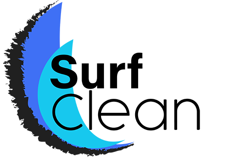

# SurfClean, par l'équipe BigEight

## SurfClean, l'application pour les surfeurs qui veulent être propres

Cette application leur permet, depuis un téléphone ou un ordinateur,

- de s'inscrire et de se connecter,
- de se divertir en jouant à un jeu similaire à Among Us, customisé selon leur thème préféré : le surf
- de consulter des statistiques sur la qualité de l'eau de leur plage préférée (à Saint-Malo),
- de consulter les produits récupérés par les autres utilisateurs de Surfclean
- (non fonctionnel) d'enregistrer une activité via un formulaire, et de déclarer les produits détectés.

L'application est disponible ici : [nuit-info.ofni.asso.fr/bigeight/](https://nuit-info.ofni.asso.fr/bigeight/).

## L'équipe BigEight

Fière de représenter la région bisontine, l"équipe Big Eight est composée d'une bande de joyeux lurons :

- Nathanaël Houn
- Cynthia Maillard
- François Poguet
- Lancelot Vega
- Éléa Jacquin
- Marie-Almina Gindre
- Loïc Grandperrin
- Jérémy Thiébaud
